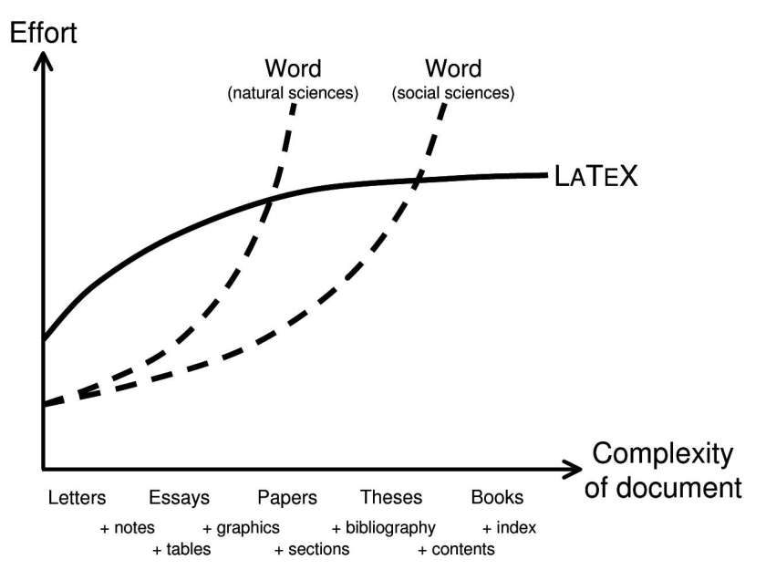

# Software recomendado 

Durante el curso se hará uso de las siguientes herramientas, otras no son necesarias pero si de gran utilidad.

# Código

## Python


Aunque los códigos del libro guía están hechos en MAXIMA, en la carpeta [codigos](../codigos/) encontará las traducción de ellos a Python.

[Python](https://www.python.org/) es un lenguaje de programación libre, creado como un pasatiempo navideño y que al día de hoy, es uno de los lenguajes más empleados y universales en el mundo. 

Para escribir código con Python lo haremos con cuadernos interactivos hechos en [Google Colab](https://colab.research.google.com/?hl=es), aunque es solo una recomendación.

Para hacer cálculo simbólico como en MAXIMA, contaremos con la librería [sympy](https://www.sympy.org/), también realizaremos cálculo algebráico con la librería [numpy](https://numpy.org/) y algunos gráficos con la librería [matplotlib](https://matplotlib.org/).

Les recomiendo:
* Buscar dudas que tengan sobre funciones específicas en la documentación o directamente en google.
* El repositorio del profesor Diego Andrés Álvarez <https://github.com/diegoandresalvarez/programaciondecomputadores>
* El reto [30-Days-Of-Python](https://github.com/Asabeneh/30-Days-Of-Python) :)

También estos 3 videos tutoriales familiarizándose con los notebooks:
* [Sobre simpy](https://www.youtube.com/watch?v=1yBPEPhq54M&ab_channel=Mr.PSolver)
* [Sobre numpy](https://www.youtube.com/watch?v=DcfYgePyedM&ab_channel=Mr.PSolver)
* [Sobre matplotlib](https://www.youtube.com/watch?v=cTJBJH8hacc&ab_channel=Mr.PSolver)

Para ver ejemplos de ```sympy```, entren a esta página <https://gamma.sympy.org/>


## MAXIMA
**MAXIMA** es un software libre para la manipulación de expresiones simbólicas y numéricas, incluyendo diferenciación, integración, expansión en series de Taylor, ecuaciones diferenciales ordinarias, sistemas de ecuaciones lineales, y vectores, matrices y tensores. **MAXIMA** produce resultados con alta precisión usando fracciones exactas y representaciones con aritmética de coma flotante arbitraria. Adicionalmente puede graficar funciones y datos en dos y tres dimensiones. Estas propiedades lo hacen útil para resolver ciertos problemas en mecánica de sólidos. A continuación se recomiendan algunas páginas donde el estudiante puede aprender por cuenta propia dicho lenguaje:

* [Página oficial de MAXIMA](http://maxima.sourceforge.net/)
* [Documentación de MAXIMA](http://maxima.sourceforge.net/documentation.html)
* [Video tutoriales elaborados por Javier Arántegui](http://vimeo.com/maximajaj)
* [Video tutoriales por Daniel Alejandro Suárez](https://www.youtube.com/playlist?list=PLFk7DOCMKbw_QrywlNmPtCmaNH_wSu28g)


## MATLAB
A continuación se recomiendan algunas páginas donde el estudiante puede aprender por cuenta propia dicho lenguaje:
* [The Mathworks (2021). Get Started with MATLAB](https://www.mathworks.com/help/matlab/getting-started-with-matlab.html)
* [Video tutoriales de MATLAB en español](http://matlablatino.blogspot.com/)
* [Video tutoriales de MATLAB realizados por Andrés Felipe Ramírez](https://www.youtube.com/playlist?list=PLj3KYX7UqPG8uZWqtQ7ZBG1DSou1fLDMS)


# Programas de computador

## COMSOL Multiphysics 3.5
[COMSOL Multiphysics](http://www.comsol.com/) es un paquete de modelado para la simulación de cualquier proceso físico que se pueda describir mediante ecuaciones en derivadas parciales (partial differential equations o PDEs). Está provisto de la última tecnología y algoritmos de resolvedores que pueden manejar problemas complejos de forma rápida y precisa, mientras que su intuitiva estructura está diseñada para proporcionar una gran facilidad de uso y flexibilidad. A continuación se recomiendan algunos enlaces donde el estudiante puede aprender por cuenta propia dicho software:

* [Video tutoriales elaborados por Felipe Uribe](https://vimeo.com/user1637955)
* Windows: Inicio -> Programas -> COMSOL -> Documentación -> Getting started guide.pdf
* Linux:
  * `/usr/local/comsol35a/doc/multiphysics/quick.pdf` 
  * `/usr/local/comsol35a/doc/multiphysics/modlib.pdf`
  * `/usr/local/comsol35a/doc/sme/smemodlib.pdf`
  * `/usr/local/comsol35a/doc/sme/smeverification.pdf`


# $\LaTeX$

$\LaTeX$ es un sistema para preparación de documentos, en el cual el usuario usa texto plano (*plain text*) en lugar de texto con formato (*What You See Is What You Get*) como lo es Microsoft Word, Google Docs, etc. 

Esto quiere decir, que permite centrarse en el cuerpo del documento y sus contenidos, pues LaTeX se encargará de organizar y numerar las figuras, tablas, referencias, saltos de página y demás elementos de la mejor manera posible. 

Tengo las siguientes recomendaciones:

1. (Para trabajar en local) Instalar el lenguaje LaTeX de la distribución de [MikTeX](https://miktex.org/download), hay otras distribuciones pero esta se comporta muy bien en MS Windows, y para trabajar el lenguaje usar el editor de [TeXstudio](https://www.texstudio.org/).

2. (Para trabajar en remoto) Crear una cuenta en la plataforma [Overleaf](https://www.overleaf.com/) y trabajar sobre plantillas que ya están creadas por otros usuarios o crear un documento desde cero. Operativamente solo requiere de internet, y permite compartir el documento con otras personas, dadno permisos para editar o solo revisar y comentar.

LaTeX funciona con paquetes (el símil de las librerías de Python) las cuales permiten poner fórmulas matemáticas, imágenes, tablas o resaltos sobre el pie de foto de las figuras, por ejemplo; es cuestión de "cacharrearle" uno o dos días y sale, no es complicado. En internet se encuentra toda la información necesaria, simplemente escribir "Cómo hacer ______ en Latex" le da entrada a cientos de páginas con mucha información, hay foros inclusive. En youtube ocurre igual.

Para mayor información sobre $\LaTeX$ ver:

* [Lista de recursos para aprender LaTeX](https://tex.stackexchange.com/questions/11/what-are-good-learning-resources-for-a-latex-beginner)
* video ["Why LaTeX?"](https://www.youtube.com/watch?v=9eLjt5Lrocw&list=PLFB8R5rtkrDqI-HER8qio0_XuctRn7rss&index=42&ab_channel=EitanLees) 




fuente: <https://www.researchgate.net/post/Why_LaTex_is_better_choice_than_Microsoft_Word/2>


# ¿GitHub?

Este repositorio funcioa en [git](https://git-scm.com/), git es el sistema de versión de controles más utilizado en el mudno según la [stackoverflow survey 2022](https://survey.stackoverflow.co/2022/#technology-version-control), permite gestionar diferentes estados de un proyeto generalmente de código, en este caso: el curso de sólidos. 

Donde estamos parados es [GitHub](), es una interfaz web (hosting de internet) para visualizar repositorios creados con git.

Para una mejor explicación consultar [este video](https://www.youtube.com/embed/DinilgacaWs?start=0&end=52).


# Recomendación final

Recuerden que estas son herramientas, por si solas solo son *bytes*, pero ustedes son quienes se apoderarán de los conceptos para hacer grandes cosas.

El software simplemente hará lo que ustedes le digan, así que mucho cuidado.